# Global Weather Repository — Analysis & Forecast

> **Product Manager Accelerator (PMA)**
>
> The Product Manager Accelerator (PMA) is a professional-development program that helps aspiring and experienced product managers break into and grow in (AI) product management. Through hands-on cohorts, students work alongside engineers, designers, and data scientists to build and launch real AI products from 0 to 1 — backed by mentorship, an active alumni network, and a strong track record of placing graduates at top tech companies and startups.

> ⚠️ **This report was generated from SYNTHETIC demo data**, because the real dataset was not present at runtime. The structure, methodology, and charts are exactly what you get on the real data — but the numbers below are illustrative only. Re-run with `--input "GlobalWeatherRepository.csv"` for real results.

## 1. Data cleaning

- Parsed `last_updated`; dropped 0 rows with an unparseable timestamp.
- Removed 1 exact-duplicate row(s).
- Dropped 0 row(s) with no temperature reading.
- Median-filled missing values in: humidity.
- Final clean dataset: 4,500 rows, 40 columns, 30 locations, 150 distinct days.

## 2. Exploratory data analysis

- Mean temperature across all records: **16.1 °C** (σ = 10.9).
- Warmest locations by mean temperature: Singapore (29.4°C), Nairobi (28.8°C), Bogota (28.5°C), Lagos (27.7°C), Bangkok (25.0°C).

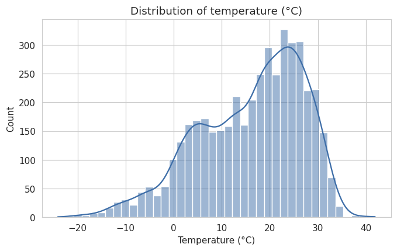

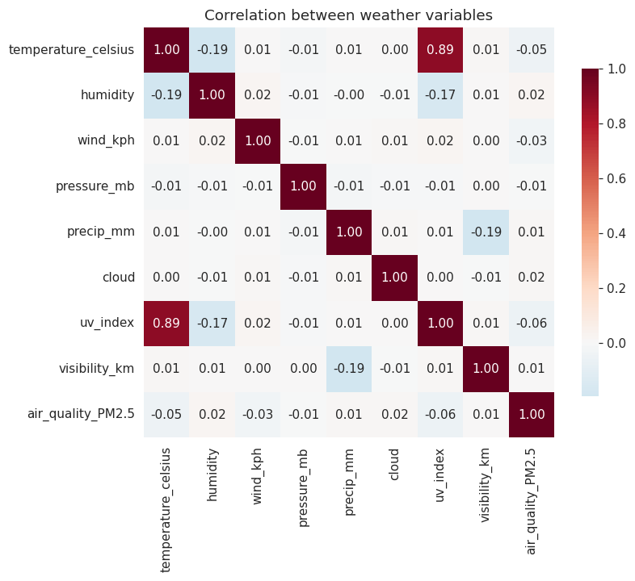

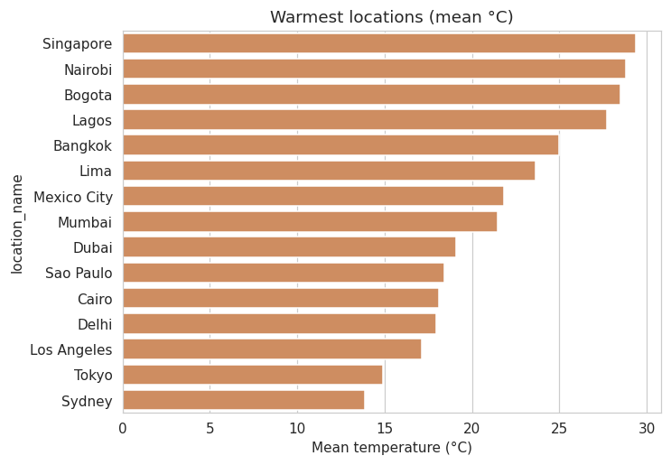

- Mean daily precipitation across all records: **1.34 mm**.
- Wettest locations by mean precipitation: Lagos (1.76 mm), Auckland (1.74 mm), Dubai (1.73 mm), Buenos Aires (1.68 mm), Rome (1.66 mm).

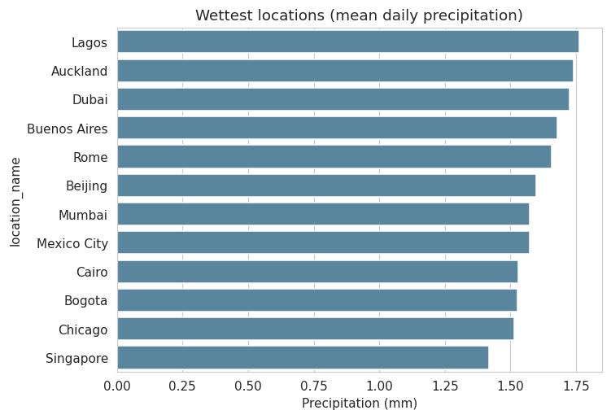

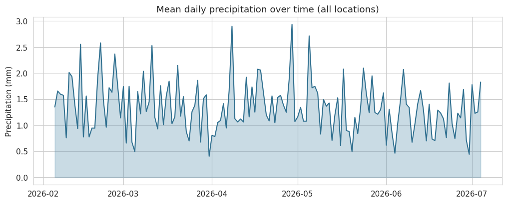

## 3. Temperature forecast

A daily mean-temperature series (**scope: Reykjavik**) was built from `last_updated`. 0 day(s) of gaps were linearly interpolated. Models use lagged values (1/2/3/7-day), rolling mean/std, and seasonal (day-of-year) features. Evaluation is on the held-out final 20% of the series.

| Model | MAE | RMSE | R² |
| --- | ---: | ---: | ---: |
| Linear ⭐ | 1.91 | 2.31 | 0.314 |
| RandomForest | 3.00 | 3.91 | -0.959 |
| GradientBoosting | 2.33 | 3.21 | -0.319 |
| Ensemble | 2.00 | 2.74 | 0.039 |

Best model by RMSE: **Linear**. The 14-day forecast ranges 21.8–23.3 °C (mean 22.5 °C).

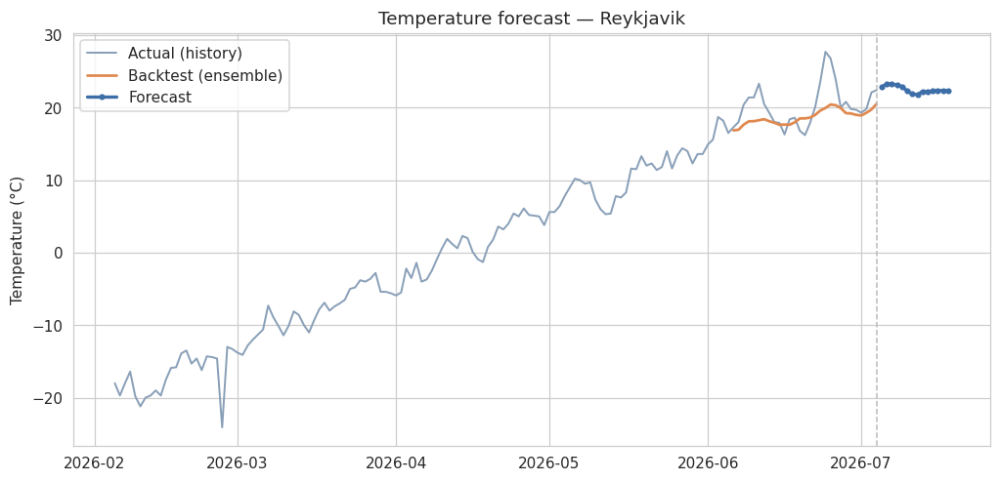

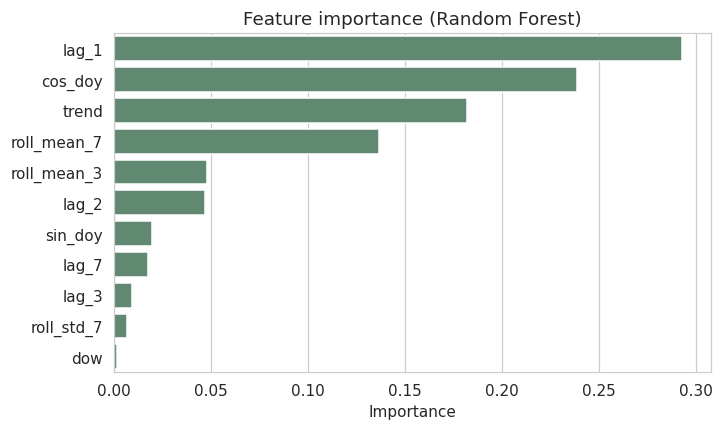

## 4. Anomaly detection

- **0** day(s) flagged as statistical outliers on the daily series (|z| > 2.5).
- **45** city-level records flagged by an Isolation Forest over temperature_celsius, humidity, wind_kph, pressure_mb, precip_mm (1% contamination).
    - Reykjavik on 2026-02-07: -18.0 °C
    - Reykjavik on 2026-02-27: -13.0 °C
    - Reykjavik on 2026-03-12: -8.1 °C
    - Reykjavik on 2026-04-20: 1.8 °C
    - Oslo on 2026-02-27: -9.4 °C

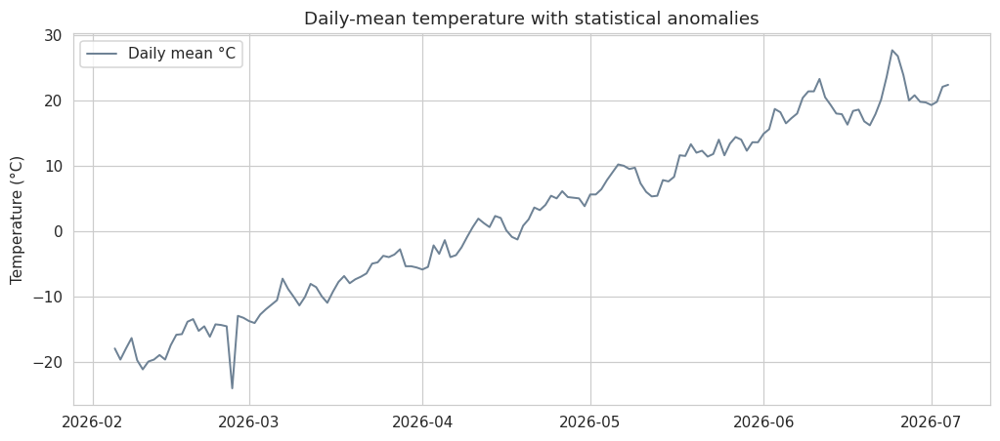

## 5. Air quality

- PM2.5 correlation with: temp = -0.048, humidity = 0.024, wind = -0.032.
- Highest mean PM2.5: Cape Town (28.3 µg/m³), Buenos Aires (26.9 µg/m³), Tokyo (26.9 µg/m³), Madrid (26.7 µg/m³), Istanbul (24.1 µg/m³).

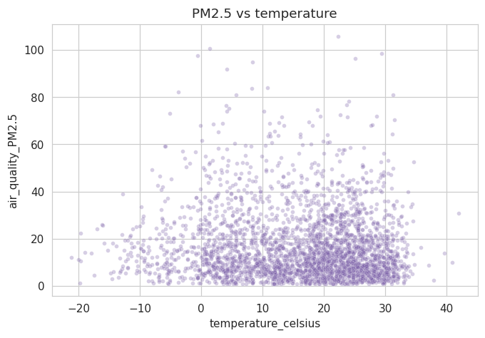

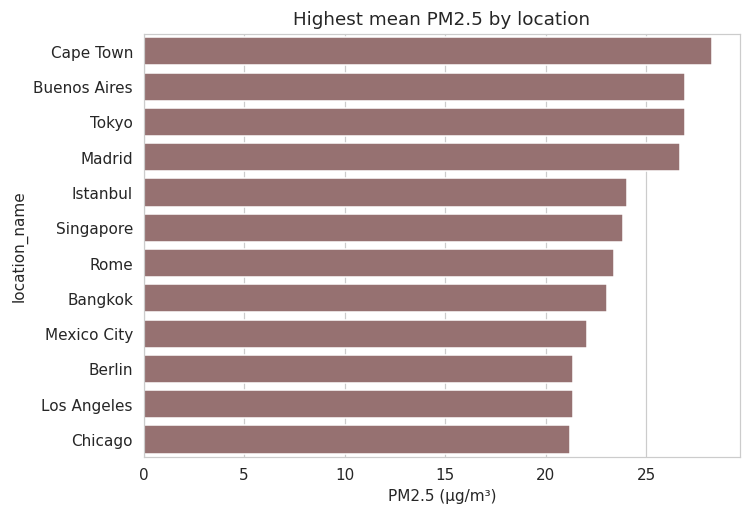

## 6. Spatial & climate patterns

- Temperature vs **absolute latitude** correlation: **-0.646** (negative = cooler toward the poles, as expected).

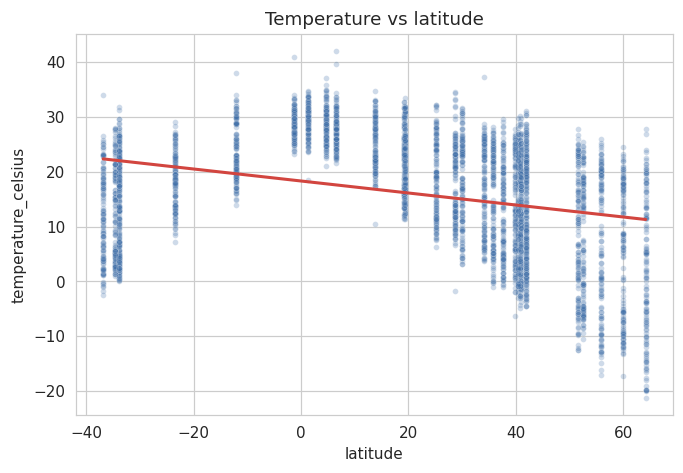

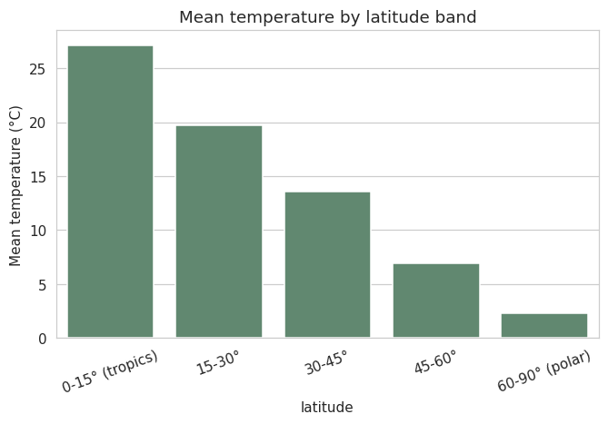

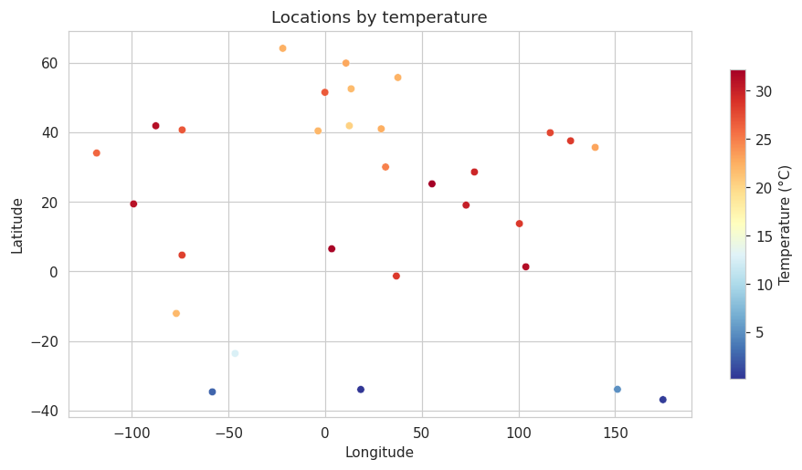

## 7. How this maps to the assessment

- **Data cleaning & preprocessing** — section 1.
- **Forecasting using `last_updated`** — section 3 (time-series features + backtest + multi-step forecast).
- **Advanced analyses** — anomaly detection (4), air-quality correlation (5), ensemble modeling (3), and spatial/climate patterns (6).

